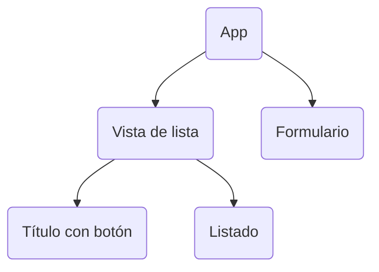

# Mantenedor de usuario

## Definición

Creación de de mantenedor de usuarios

- Debe traer los datos solo cuando inicia la aplicación

- Se debe poder realizar operaciones CRUD
  - CREATE, READ, UPDATE y DELETE

## Vistas propuestas

**Listado:** Al apretar en **nuevo** o **editar** se debería mostrar una interfase en donde se puedan modificar y/o indicar nuevos datos.

**Nuevo Usuario:** Luego de guardar el usuario se debe mostrar el listados de usuarios con el usuario que se ingresó.

-----

### Listado

Usuarios   **[btn nuevo]**

- Nombre de usuario **[btn Editar]**

- Nombre de usuario **[btn Editar]**

--------

### Nuevo Usuario

<input Nombre> 

<input email>

<input sitio web>

**[btn Guardar]**

---------------

# Solución

En componente  App solo tendrá las acciones a realizar, guardar estado y guardar datos del formulario.

Se usará el **estado** de componente app para guardar todos los datos. 

Se creará un componente listado para mostrar los usuarios.

Se creará un componente form para guardar los valores del formulario.

Cuando el usuario haga clic en botón de nuevo se cambiará la propiedad del estado que indicará que el usuario esta cambiando de vista.

Cuando el usuario haga clic en editar, se usará el mismo método entregándole el ID del elemento para diferenciar si está editando o creando.

# Diagrama

**App:**

- Guarda en state los usuarios

- Métodos que le entregará al formulario

**Vista  de lista:**

- Contiene link a vista formulario

**Formulario:**

- Recibe método para guardar  los datos de App

**Título con botón:**

Contiene link a vista formulario

